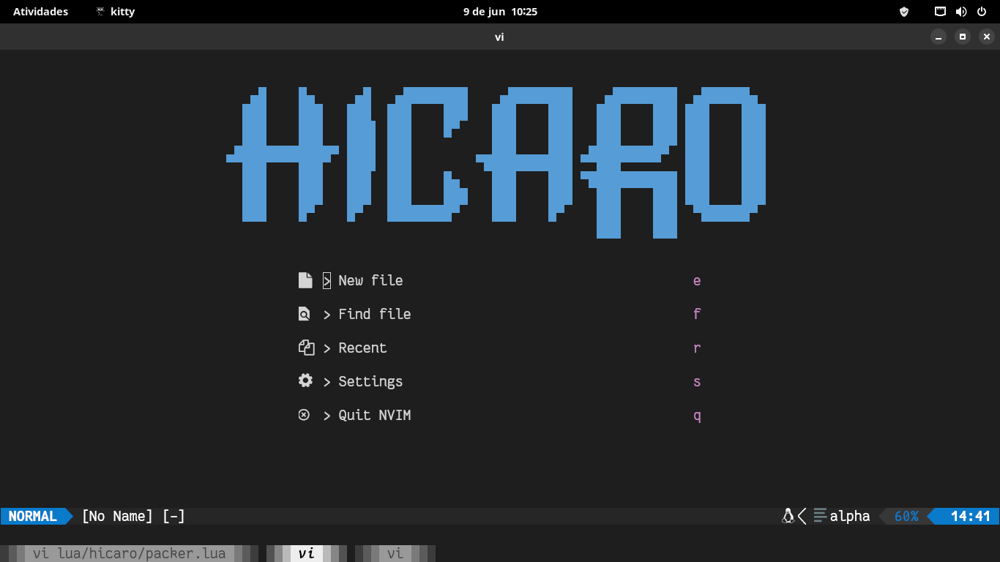
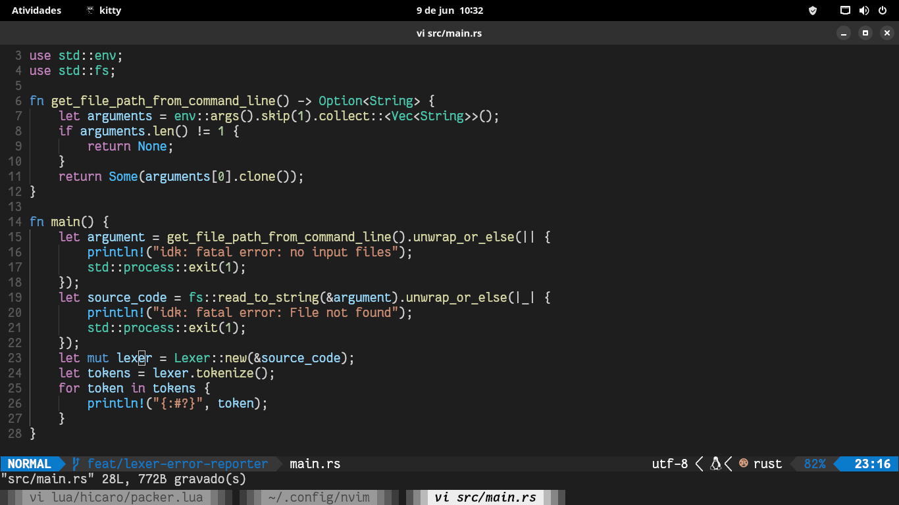
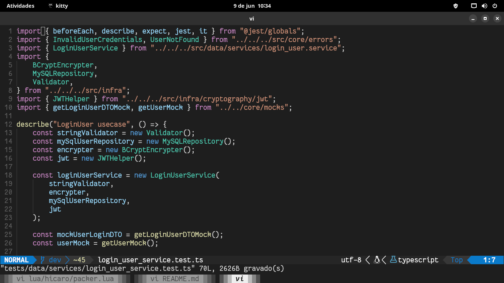
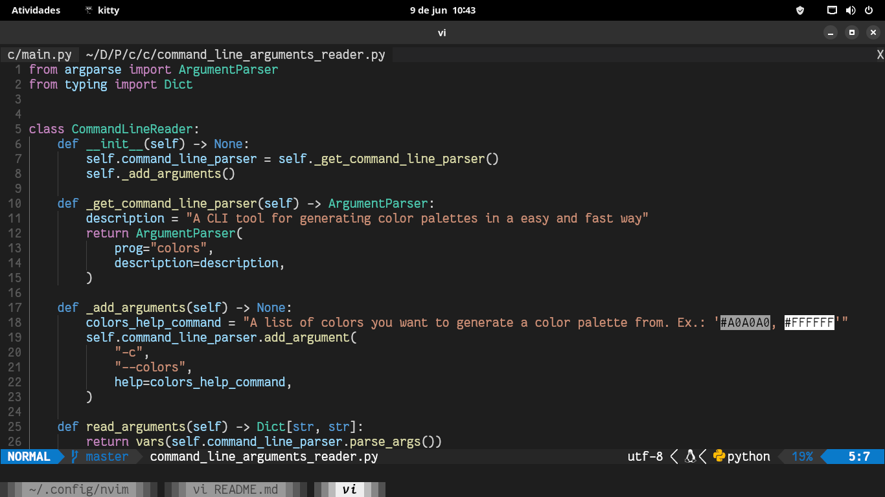
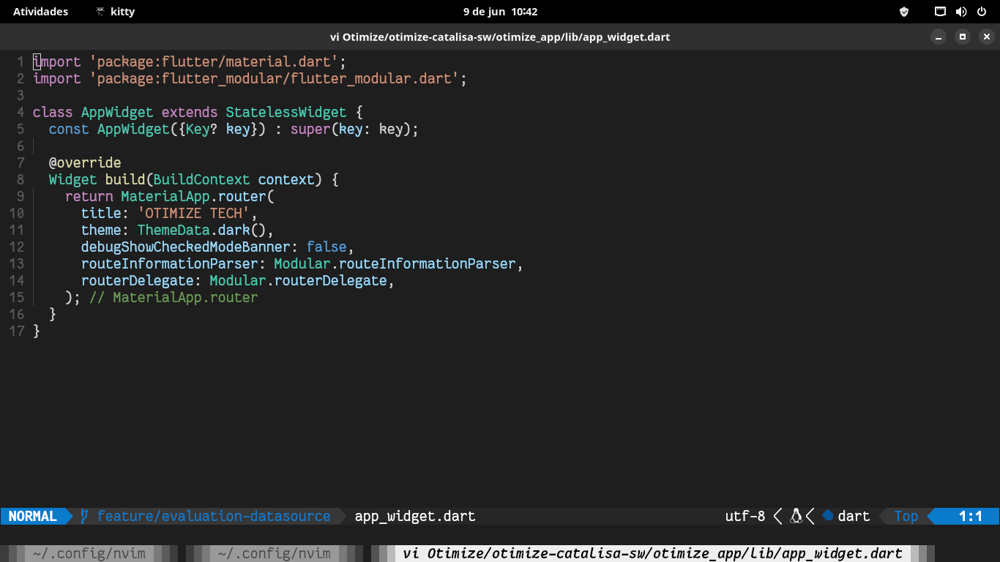

# nvim

My Neovim configuration built from scratch with Lua.

## Front screen



### Languages

1. Rust



2. Typescript



3. Python



4. Dart



## Configuration

1. CoC

I use CoC for autocompletion. To install all my extensions, use the following command:

```
:CocInstall coc-pyright coc-xml coc-snippets coc-java coc-tsserver coc-go coc-prisma coc-flutter-tools coc-json coc-clangd coc-markdownlint coc-prettier coc-eslint coc-floatinput coc-html coc-css coc-emmet
```

## License

This project is licensed under the MIT license. See [LICENSE](./LICENSE).
